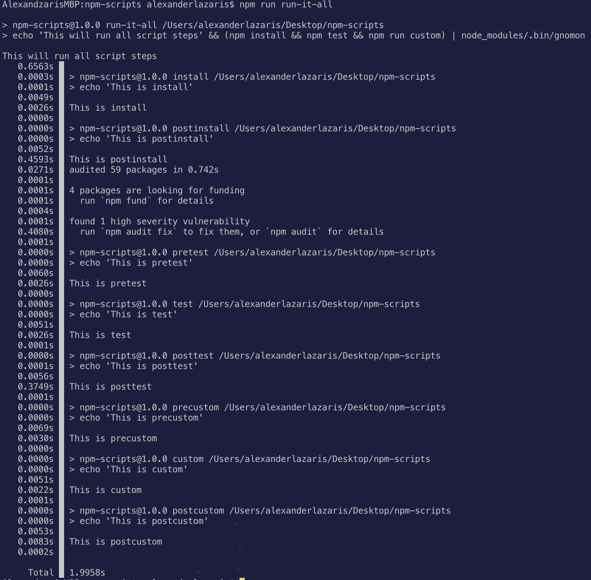

# npm-scripts
Example of you can include `pre` & `post` into different npm scripts. Use cases include:
* hooks
* cleanup tasks

Inspired by https://docs.npmjs.com/cli/v8/using-npm/scripts

Using https://github.com/paypal/gnomon to display script duration

